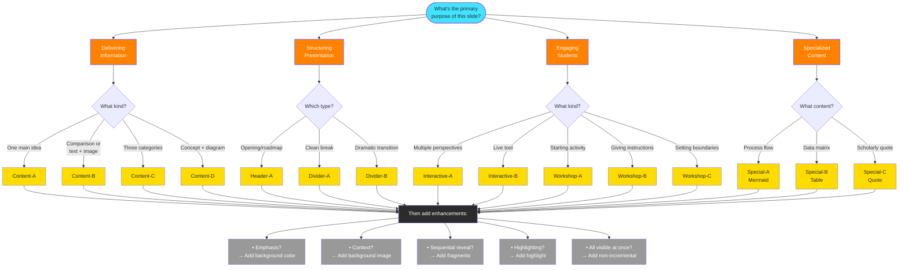

# Reveal.js Slide Templates Reference
## SMUA 4500 Smart Cities Course

This document provides a hierarchical template system:
- **Base Templates**: Core slide structures (column layouts, etc.)
- **Add-on Elements**: Modifiers that enhance any base template
- **Specialized Slides**: Pre-configured combinations for specific purposes

Reference templates using: `Category-Letter` (e.g., Content-A, Interactive-B)

---

## Table of Contents
1. [Document Structure](#document-structure)
2. [Base Templates](#base-templates)
3. [Add-on Elements](#add-on-elements)
4. [Specialized Slides](#specialized-slides)
5. [Quick Reference](#quick-reference)

---

## Complete Template Reference

| Base Templates | Add-on Elements | Specialized Slides |
|----------------|-----------------|-------------------|
| **Content-A**: Single Column | Background Color | **Special-A**: Mermaid Diagram |
| **Content-B**: Two-Column | Background Image | **Special-B**: Comparison Table |
| **Content-C**: Three-Column | Gradient Background | **Special-C**: Quote with Context |
| **Content-D**: Single Column + Image | Fragment (Sequential Reveal) | |
| **Header-A**: Session Roadmap | Highlight | |
| **Divider-A**: Section Break | Fitted Text | |
| **Divider-B**: Full-Screen Text | Absolute Positioned Images | |
| **Interactive-A**: Tabbed Panels | Stretched Media | |
| **Interactive-B**: Embedded Tool | Non-Incremental | |
| **Workshop-A**: Activity Introduction | Callout Box | |
| **Workshop-B**: Step-by-Step Instructions | Block Quote | |
| **Workshop-C**: Focus Statement | Notes (always bullets) | |

**Usage:** Combine one Base Template + any number of Add-on Elements to create your slide. Specialized Slides are pre-configured combinations for specific use cases.

---

## Document Structure

### YAML Header (Standard)
```yaml
---
title:  "Your Title Here" 
subtitle: Your subtitle here
format: 
    revealjs:
        slide-number: true
        theme: ../oslomet-pres.scss
        center: true
        transition: fade
        footer: "SMUA 4500 Smart Cities - Your Name ©"
        incremental: true
title-slide-attributes: 
  data-background-image: img/your-image.jpg
  data-background-opacity: "0.5"
---
```

**When to use:**
- Required at the start of every presentation file
- Adjust title, subtitle, footer, background image as needed
- `incremental: true` makes bullets appear one at a time (can override per slide)

---

## Base Templates

These are fundamental slide structures. Combine them with add-on elements for more complex slides.

---

### Content-A: Single Column (Standard)
**Purpose:** Basic content slide with bullets or paragraphs

```markdown
## Your Slide Title
* Main point one
* Main point two
* Main point three
    * Nested sub-point
    * Another sub-point

::: {.notes}
- Teaching point about this content
- Connection to course objectives
- Timing or pacing guidance
:::
```

**When to use:**
- General information delivery
- Simple lists or concepts
- When visual elements aren't needed

**Default behavior:**
- Bullets appear incrementally (one at a time)
- Centered on slide

---

### Content-B: Two-Column Layout
**Purpose:** Side-by-side content (text/text, text/image, etc.)

```markdown
## Slide Title
:::::: {.columns}
::: {.column width="60%"}
Left column content here:
- Bullet points
- Paragraphs
- Any content
:::
::: {.column width="40%"}
Right column content:
- More bullets
- Or an image
- Or a quote
:::
::::::

::: {.notes}
- Why this two-column structure?
- How to present left vs right
- Connections between columns
:::
```

**When to use:**
- Comparisons or contrasts
- Text with supporting image
- Quote with book cover/portrait
- Before/after scenarios

**Variations:**
- Adjust column widths (50/50, 60/40, 70/30, etc.)
- Can contain any content type in either column

---

### Content-C: Three-Column Layout
**Purpose:** Triple comparison or categorization

```markdown
## Slide Title
:::::: {.columns}
::: {.column width="33%"}
### Category One
- Point A
- Point B
:::
::: {.column width="33%"}
### Category Two
- Point C
- Point D
:::
::: {.column width="33%"}
### Category Three
- Point E
- Point F
:::
::::::

::: {.notes}
- Relationship between three categories
- Order of presentation
- Key distinctions to emphasize
:::
```

**When to use:**
- Comparing three approaches/models/concepts
- Past/Present/Future timelines
- Three-part frameworks

---

### Content-D: Single Column + Image
**Purpose:** Centered content with supporting visual

```markdown
## Slide Title
Your main text content here as a paragraph or bullets.

{height="400px" fig-alt="Description"}

::: {.notes}
- How the image supports the content
- What to point out in the image
- Connection to next slide
:::
```

**When to use:**
- Concept explanation with diagram
- Process with visual representation
- Example with screenshot

**Image positioning:**
- Image appears below text by default
- Use add-on elements for other positions

---

### Header-A: Session Roadmap
**Purpose:** Presentation opening that outlines structure

```markdown
## Session Roadmap {background-image="img/your-background.jpg" background-opacity="0.5"} 
- **Part I: First Major Section**
    - Subsection detail
    - Subsection detail
- **Part II: Second Major Section**
    - Subsection detail
    - **Workshop I:** Activity name
- **Part III: Third Major Section**
    - **Workshop II:** Activity name

::: {.notes}
- Flow and logic of session structure
- Time allocation per section
- How sections build on each other
:::
```

**When to use:**
- First content slide of presentation
- Sets expectations for session

**Key features:**
- Bold section headers
- Workshop activities highlighted
- Background image for context

---

### Divider-A: Section Break (Minimalist)
**Purpose:** Clean transition between major sections

```markdown
# The Main Section Title
_Part I_
```

**When to use:**
- Transitioning between major parts
- Resetting audience attention
- Creating dramatic pause

**No notes needed** - this is purely structural

---

### Divider-B: Full-Screen Text
**Purpose:** Dramatic announcement or transition

```markdown
# Workshop
::: {.r-fit-text}
Mapping your wicked problem
:::
```

**When to use:**
- Workshop announcements
- Major topic changes
- Key questions or provocations

**Key features:**
- `.r-fit-text` scales text to fill screen
- Maximum visual impact

---

### Interactive-A: Tabbed Panels
**Purpose:** Multiple related content sections without multiple slides

```markdown
## Slide Title {background-color="#ffffff"}

::: {.panel-tabset .nonincremental}
### First Tab Name
* Content for first tab
* Point one
* Point two

### Second Tab Name
* Content for second tab
* Different perspective
* Related information

### Third Tab Name
* Content for third tab
* Additional examples
* Alternative view
:::

::: {.notes}
- How to navigate tabs during presentation
- What each tab represents
- When to use each section
- Key comparisons between tabs
:::
```

**When to use:**
- Case study variations
- System archetypes examples
- Multiple perspectives on same topic
- Before/during/after scenarios

**Key features:**
- `.panel-tabset` creates clickable navigation
- `.nonincremental` shows all content in each tab at once
- Each `###` becomes a tab label

---

### Interactive-B: Embedded Tool
**Purpose:** Live web-based tool in presentation

```markdown
## Tool Name {background-color="#ffffff"}
[_tool name_](https://tool-website.com)

<iframe width="800" height="600" frameborder="0" src="https://tool-url-here"></iframe>

::: {.notes}
- Purpose of using this tool in class
- What students should do/observe
- How to demo or facilitate interaction
- Fallback if tool doesn't load
:::
```

**When to use:**
- Interactive simulations
- Mapping/diagramming tools
- Live data visualizations

**Key features:**
- White background prevents distraction
- Link to tool provided above iframe
- Adjust dimensions as needed

---

### Workshop-A: Activity Introduction
**Purpose:** Clear workshop setup and goals

```markdown
## Workshop: Activity Name {.nonincremental background-color="#FFDC00"}
_Tool: [tool-website.com](https://tool-website.com)_

::: {.callout title="The Mission"}
Brief, clear description of what students will accomplish.
:::

::: {.notes}
- Learning objectives for this activity
- Expected duration
- How it connects to project work
- What success looks like
:::
```

**When to use:**
- Start of any hands-on activity
- Workshop kickoff
- Group exercise introduction

**Key features:**
- Yellow background signals "active learning"
- `.nonincremental` shows all info immediately
- `.callout` box for clear mission

---

### Workshop-B: Step-by-Step Instructions
**Purpose:** Multi-phase workshop guidance

```markdown
## Workshop: Activity Name {.nonincremental background-color="#FFDC00"}

:::::: {.columns}
::: {.column}
### 1. First Phase
* **Action:** What to do
* **Goal:** What this achieves
* **Consideration:** What to think about
:::

::: {.column}
### 2. Second Phase
* **Action:** Next steps
* **Goal:** Purpose
* **Consideration:** Key questions
:::
::::::

::: {.notes}
- Timing for each phase
- Common student questions
- How to circulate and support
- What to watch for
:::
```

**When to use:**
- Multi-step activities
- Sequenced workshop tasks
- Phased group work

**Key features:**
- Numbered phases for clarity
- Bold labels for action/goal/consideration
- Two-column keeps instructions visible

---

### Workshop-C: Focus Statement
**Purpose:** Clarify workshop scope and boundaries

```markdown
## Workshop: What we are doing {background-color="#FFDC00"}

> Focus on the **Logic**, not the math.

:::::: {.columns}
::: {.column .fragment}
#### 🎯 The Focus
* **Element One:** What we're doing
* **Element Two:** Key priority
* **Element Three:** Main goal
:::
::: {.column .fragment}
#### 🛑 Not Today
* **Out of Scope One:** What to skip
* **Out of Scope Two:** Save for later
* **Out of Scope Three:** Ignore this
:::
::::::

::: {.notes}
- Why these boundaries matter
- Managing student expectations
- Common scope creep to prevent
- What comes in future sessions
:::
```

**When to use:**
- Before complex activities
- When scope confusion is likely
- Setting realistic expectations

**Key features:**
- Quote establishes mindset
- Emoji icons for visual scanning
- Fragmented reveal for emphasis

---

## Add-on Elements

These modifiers enhance any base template. Combine multiple add-ons as needed.

---

### Add-on: Background Color
**Purpose:** Emphasize slides with brand colors

**Syntax:** Add to slide title line
```markdown
## Slide Title {background-color="#FF8100"}
```

**Available colors:**
- **Orange** `#FF8100`: Critical concepts, warnings, "watch out"
- **Yellow** `#FFDC00`: Workshops, active learning (default for Workshop templates)
- **Cyan** `#40E4FF`: Core concepts, frameworks, foundations
- **White** `#ffffff`: Tools, embedded content, clean backgrounds
- **Dark** `#2b2b2b`: Professional, serious, technical content

**When to use:**
- Content-A through Content-D: Add visual emphasis
- Divider slides: Strengthen section break
- Already included in Workshop templates by default

---

### Add-on: Background Image
**Purpose:** Atmospheric or contextual imagery behind content

**Syntax:** Add to slide title line
```markdown
## Slide Title {background-image="img/your-image.jpg" background-opacity="0.5"}
```

**Opacity guidelines:**
- `0.3`: Very subtle, text-heavy slides
- `0.5`: Standard balance (most common)
- `0.7`: Prominent image, minimal text

**When to use:**
- Header-A: Contextual imagery for roadmap
- Content slides: When image reinforces concept
- Quote slides: Author context or subject matter

**Best practices:**
- Use images that don't compete with text
- Maintain opacity at 0.5 or below for readability
- Ensure sufficient contrast

---

### Add-on: Gradient Background
**Purpose:** Modern, clean background for data/tables

**Syntax:** Add to slide title line
```markdown
## {background-gradient="linear-gradient(to bottom, #2b2b2b, #FF8100)"}
```

**When to use:**
- Tables or data matrices
- Content that needs visual separation
- Modern, tech-focused content

**Note:** Leave title empty (`##` with no text) for cleaner look

---

### Add-on: Fragment (Sequential Reveal)
**Purpose:** Make elements appear one at a time

**Syntax:** Wrap content in fragment container
```markdown
::: {.fragment}
Content appears on click
:::
```

**Common uses:**
- Individual columns in multi-column layouts
- Images or diagrams
- Emphasis text or conclusions
- Step-by-step reveals

**Example with Content-B:**
```markdown
## Comparison
:::::: {.columns}
::: {.column .fragment}
First concept appears
:::
::: {.column .fragment}
Then second concept
:::
::::::
```

---

### Add-on: Highlight
**Purpose:** Emphasize text after initial reveal

**Syntax:**
```markdown
:::{.fragment .highlight-red}
**This text gets highlighted**
:::
```

**Available colors:**
- `.highlight-red`: Critical points, warnings
- `.highlight-blue`: Information, analysis
- `.highlight-green`: Positive, success, growth
- `.highlight-yellow`: Attention, important

**When to use:**
- After explaining context, highlight key takeaway
- Draw attention to specific concept
- Emphasize conclusions or implications

---

### Add-on: Fitted Text
**Purpose:** Scale text to fill available space

**Syntax:**
```markdown
::: {.r-fit-text}
TEXT SCALES TO FIT SCREEN
:::
```

**When to use:**
- Divider-B: Already included
- Emphasis statements
- Key questions or provocations
- Workshop titles

**Works with:**
- Short phrases (2-8 words)
- Single sentences
- Numbers or statistics

---

### Add-on: Absolute Positioned Images
**Purpose:** Images that overlay specific screen positions

**Syntax:**
```markdown
{.fragment .absolute top=200 left=10 width="300"}
```

**Position parameters:**
- `top=X`: Pixels from top
- `left=X`: Pixels from left
- `right=X`: Pixels from right
- `width="X"`: Image width

**When to use:**
- Before/after comparisons (images replace each other)
- Examples appearing over categories
- Revealing multiple related visuals

**Example - overlapping reveals:**
```markdown
## Categories {background-color="#FF8100"}
:::::: {.columns}
::: {.column}
### Natural Systems
:::
::: {.column}
### Technical Systems
:::
::::::

{.fragment .absolute top=200 left=10 width="300"}
{.fragment .absolute top=200 right=150 width="300"}
{.fragment .absolute top=200 left=10 width="300"}
{.fragment .absolute top=200 right=150 width="300"}
```

**Note:** 
- Later images can occupy same position as earlier ones
- Use `.fragment` to control timing
- Test positions for your screen size

---

### Add-on: Stretched Media
**Purpose:** Video or image fills available vertical space

**Syntax:**
```markdown
:::{.r-stretch} 

:::
```

**When to use:**
- Embedded videos
- Large demonstration images
- Interactive visualizations

**Note:**
- Maintains aspect ratio
- Adjusts to available space after title
- Works with video, images, iframes

---

### Add-on: Non-Incremental
**Purpose:** Override default incremental bullets

**Syntax:** Add to slide title
```markdown
## Slide Title {.nonincremental}
```

**When to use:**
- Workshop templates: Already included (students need all steps)
- Reference slides: Full context needed immediately
- Tables: All data visible at once
- Interactive-A: Tab navigation requires visibility

**Already included in:**
- Workshop-A, Workshop-B, Workshop-C
- Interactive-A (tabbed panels)

---

### Add-on: Callout Box
**Purpose:** Highlight important information or goals

**Syntax:**
```markdown
::: {.callout title="Your Title"}
Your highlighted content here
:::
```

**When to use:**
- Workshop goals or missions
- Key definitions
- Important warnings
- Learning objectives

**Already included in:**
- Workshop-A (for mission statement)

---

### Add-on: Block Quote
**Purpose:** Feature scholarly quotes or important statements

**Syntax:**
```markdown
> "Your quotation here that can span multiple lines."
>
> — *Author Name, Year*
```

**When to use:**
- Content-B: Quote in one column, context in other
- Scholarly references
- Defining concepts through experts
- Historical context

**Formatting:**
- Empty line with `>` before attribution
- Attribution in italics with em dash

---

### Add-on: Notes (Always Bullets)
**Purpose:** Speaker notes for every slide

**Syntax:**
```markdown
::: {.notes}
- First teaching point or context
- Connection to course objectives
- Anticipated student questions
- Timing or pacing guidance
- Links to other concepts or slides
:::
```

**Every slide should include notes with:**
- Why this content matters (pedagogy)
- How to present it (delivery)
- What to emphasize (key points)
- When/how to pause for discussion
- Connections to assignments or other sessions

**Always use bullets** - no paragraph format in notes

---

## Specialized Slides

Pre-configured combinations for specific use cases.

---

### Special-A: Mermaid Diagram
**Purpose:** Process flows, causal loops, conceptual relationships

**Base:** Content-A (single column) + Mermaid code block

```markdown
## Slide Title

```{mermaid}
flowchart LR

subgraph G1["Section Label"]
    A["Step One<br/>Description"]
    B["Step Two<br/>Description"]
end

C["Next Step"]
D["Following Step"]
E((("Final<br/>Outcome")))

A ==> B
B --> C
C --> D
D --> E
D -..-> B 
E -.-> A

classDef yellow fill:#FFDC00,color:#2b2b2b,stroke-width:0px;
classDef gray fill:#999999,color:#ffffff,stroke-width:0px;
style G1 fill:#2b2b2b,color:#ffffff,stroke:#eee,stroke-width:2px

class A,B yellow
class C,D,E gray
```
```

::: {.notes}
- What the diagram represents
- Key relationships to emphasize
- How to walk through the flow
- Connection to systems thinking concepts
:::
```

**When to use:**
- System dynamics diagrams
- Process flows
- Causal loop diagrams
- Conceptual frameworks

**Styling:**
- Use brand colors (yellow, orange, cyan)
- `<br/>` for line breaks in nodes
- Different arrow types for different relationships

---

### Special-B: Comparison Table
**Purpose:** Matrix comparing multiple models/approaches

**Base:** Content-A (single column) + Gradient background + Fitted text

```markdown
## {background-gradient="linear-gradient(to bottom, #2b2b2b, #FF8100)"}
Explanatory text above table

:::{.r-fit-text}

| Header 1 | Header 2 | Header 3 | Header 4 | Header 5 |
|----------|----------|----------|----------|----------|
| Data A   | Data B   | Data C   | Data D   | Data E   |
| Data F   | Data G   | Data H   | Data I   | Data J   |

:::

::: {.notes}
- How to read the table
- Key comparisons to highlight
- Pattern or trend to notice
- Connection to decision-making
:::
```

**When to use:**
- Model comparisons
- Framework matrices
- Strengths/weaknesses
- Capability charts

**Features:**
- No title (cleaner presentation)
- `.r-fit-text` scales table to screen
- Gradient background for visual interest

---

### Special-C: Quote with Context
**Purpose:** Scholarly quote with background imagery

**Base:** Content-B (two-column) + Background image + Block quote

```markdown
## Slide Title {background-image="img/context-image.jpg" background-opacity="0.5"}
_Author Name_

:::: {.columns}
::: {.column}
Contextual setup:

- Related point one
- Related point two
:::
::: {.column}
Main concept [term]():

- Key explanation
- Further elaboration
:::
:::: 

::: {.notes}
- Who the author is and their significance
- Historical/theoretical context
- Why this quote matters for smart cities
- How to connect to student projects
:::
```

**When to use:**
- Introducing key theoretical concepts
- Scholarly foundations
- Historical perspectives
- Defining complex terms through experts

**Features:**
- Author name in italics below title
- Background image provides context
- Empty link syntax `[term]()` for visual emphasis

---

## Quick Reference

### Base Template Selection

**For basic content delivery:**
- **Content-A**: Single column, standard bullets
- **Content-B**: Two columns (text/text, text/image)
- **Content-C**: Three columns (comparisons, categories)
- **Content-D**: Single column with supporting image

**For structure:**
- **Header-A**: Session roadmap/opening
- **Divider-A**: Clean section break
- **Divider-B**: Dramatic full-screen transition

**For interaction:**
- **Interactive-A**: Tabbed panels (multiple perspectives)
- **Interactive-B**: Embedded web tools

**For activities:**
- **Workshop-A**: Activity introduction and mission
- **Workshop-B**: Step-by-step instructions
- **Workshop-C**: Focus and scope clarification

**For special cases:**
- **Special-A**: Mermaid diagrams/flows
- **Special-B**: Comparison tables
- **Special-C**: Scholarly quotes with context

---

### Add-on Element Quick Reference

| Add-on | Syntax | Use Case |
|--------|--------|----------|
| **Background Color** | `{background-color="#FF8100"}` | Emphasis, categorization |
| **Background Image** | `{background-image="img/x.jpg" background-opacity="0.5"}` | Context, atmosphere |
| **Gradient** | `{background-gradient="linear-gradient(...)"}` | Modern look, tables |
| **Fragment** | `::: {.fragment}` | Sequential reveals |
| **Highlight** | `.highlight-red` | Emphasize after reveal |
| **Fitted Text** | `::: {.r-fit-text}` | Scale text to screen |
| **Absolute Position** | `{.fragment .absolute top=X left=Y}` | Overlay images |
| **Stretched Media** | `::: {.r-stretch}` | Videos, large images |
| **Non-Incremental** | `{.nonincremental}` | Show all bullets at once |
| **Callout** | `::: {.callout title="X"}` | Highlight key info |
| **Block Quote** | `> "Quote" — *Author*` | Scholarly citations |
| **Notes** | `::: {.notes}` | Speaker notes (always bullets) |

---

### Common Combinations

**Content-B + Background Color + Fragment**
```markdown
## Comparison {background-color="#40E4FF"}
:::::: {.columns}
::: {.column .fragment}
First approach
:::
::: {.column .fragment}
Second approach
:::
::::::
```

**Content-A + Background Image + Highlight**
```markdown
## Key Concept {background-image="img/x.jpg" background-opacity="0.5"}
Context explanation here

:::{.fragment .highlight-red}
**Critical takeaway**
:::
```

**Content-B + Quote + Image + Notes**
```markdown
## Theory {background-image="img/book.jpg" background-opacity="0.3"}
:::::: {.columns}
::: {.column width="60%"}
> "Important quote"
> — *Author, Year*
:::
::: {.column width="40%"}
{height="400px"}
:::
::::::

::: {.notes}
- Context for quote
- Key implications
- Connection to course
:::
```

---

### Decision Tree



---

### Notes Guidelines

**Every slide should have notes with bullets covering:**

```markdown
::: {.notes}
- Pedagogical context (why this matters)
- Delivery guidance (how to present)
- Key emphasis points (what to stress)
- Student connections (project relevance)
- Timing/pacing (when to pause)
- Common questions (anticipate confusion)
- Links to other content (what comes before/after)
:::
```

**Always use bullet points** - never paragraph format
**Include for every slide** - even simple ones
**Think about teaching** - not just content

---

### File Organization

**Naming convention:**
- Presentation files: `#_topic_name_notes.qmd`
- Image folder: `img/`
- Theme file: `../oslomet-pres.scss`

**Slide structure:**
1. YAML header (document structure section)
2. Header-A (roadmap slide)
3. Divider-A (section break)
4. Content slides with add-ons
5. Interactive or Workshop slides as needed
6. Divider-A (next section)
7. Repeat 4-6 as needed

---

### Template Naming Convention

**Format:** `Category-Letter`

**Categories:**
- `Content-X`: Information delivery slides
- `Header-X`: Opening/roadmap slides
- `Divider-X`: Section transitions
- `Interactive-X`: Engagement/tools
- `Workshop-X`: Activities
- `Special-X`: Unique configurations

**Examples in use:**
- "Use Content-B for this comparison"
- "Add Workshop-A before the activity"
- "Start with Header-A roadmap"
- "Create Special-A diagram for the process"

---

## How to Use This System

### For Creating New Content

1. **Choose base template** from decision tree
2. **Add required elements** (title, content, notes)
3. **Apply add-ons** as needed (background, fragments, etc.)
4. **Always include notes** with bullets
5. **Test incremental behavior** (override if needed)

### For Formatting Existing Content

1. **Identify content structure** (columns? lists? quotes?)
2. **Match to base template**
3. **Note which add-ons are already present**
4. **Request specific formatting**: "Format as Content-B with background color and fragments"

### For Communicating with AI

**Clear requests:**
- ✅ "Format this as Content-B with orange background"
- ✅ "Use Workshop-A template for this activity"
- ✅ "Create Special-A Mermaid diagram showing this process"

**Instead of:**
- ❌ "Make it two columns"
- ❌ "Add a workshop slide"
- ❌ "Create a diagram"

---
