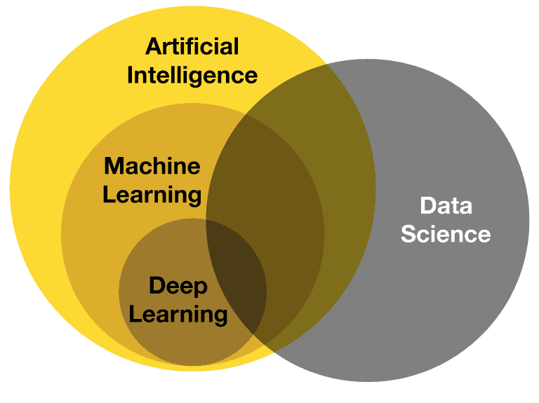
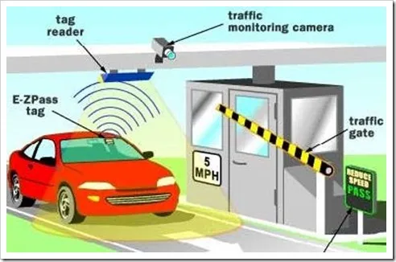
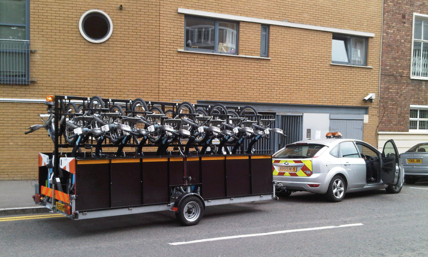
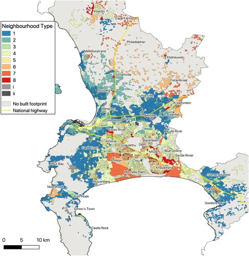
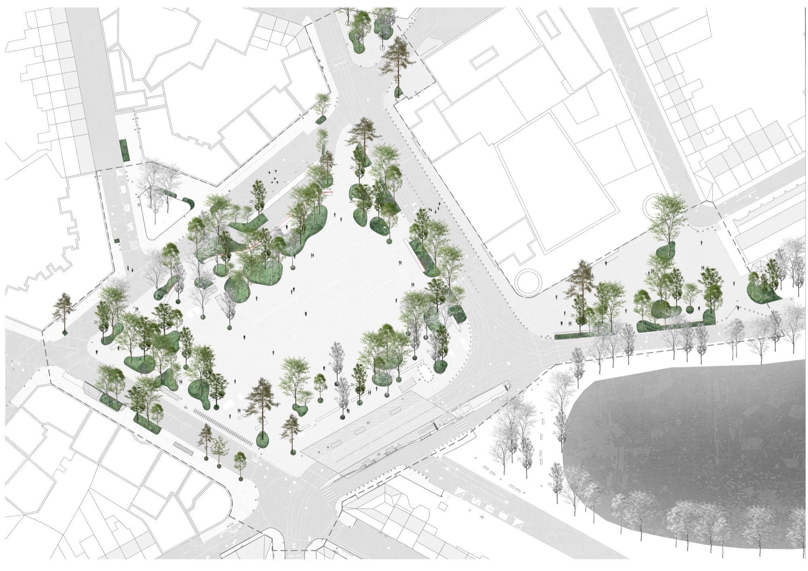
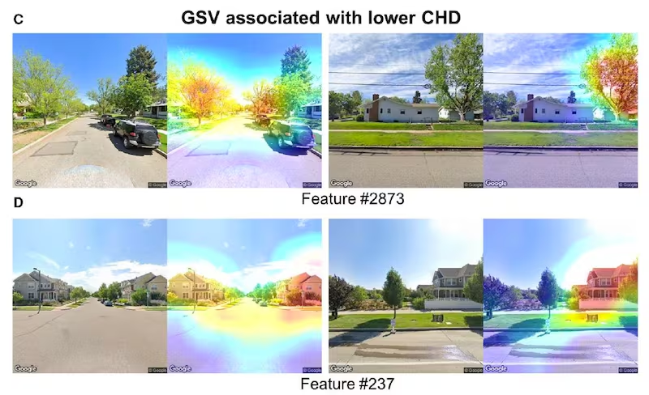

## Session Roadmap {background-image="images/digital_twins.jpg" background-opacity="0.3" }
:::{.nonincremental}
- **Act I: The Philosophical Shift** (Logic vs. Data)
- **Act II: The Toolbox** (ML for Planners)
- **Act III: AI & The Digital Twin** (The Brain and the Body)
- **Act IV: The Skeptical Planner** (Ethics and Limitations)
:::

::: {.notes}
- This lecture bridges the gap between the Systems Thinking session (Part I) and the practical application of AI.
- Part I was about the 'Web of Interactions' we can see.
- Part II is about the 'Black Box' we often can't see. 
:::

# Act I : Philosophical Shift
_Moving from transparent logic $\rightarrow$ opaque data_

## Recap {.r-stretch background-gradient="linear-gradient(to bottom, #2b2b2b, #4c462dff)"}
> "Logic Precedes Display"

<br>

:::::: {.columns}
::: {.column width="32%" .fragment}
### Systems Thinking
*We* draw the arrows. 

*We* define the relationships. 
:::
::: {.column width="2%"}
<!-- Empty column to act as space -->
:::

::: {.column width="32%" .fragment}
### Transparency {.r-fit-text}
Every feedback loop is traceable.   
:::
::: {.column width="2%"}
<!-- Empty column to act as space -->
:::

::: {.column width="32%" .fragment}
### Human Brain {.r-fit-text}
The planner remains the architect of the system logic. 
:::
::::::

::: {.notes}
- Recall our previous session: 'Logic must precede display.' 
- In traditional modeling, if the model predicts traffic, we know it's because of the gravity equation or network topology we chose. 
:::

## The New Paradigm {.r-stretch background-gradient="linear-gradient(to bottom, #2b2b2b, #4c462dff)"}
> "Data Precedes Logic"

<br>

:::::: {.columns}
::: {.column width="32%" .fragment}
### AI Shift {.r-stretch}
We provide the "Display" (historical data), and the AI guesses the "Logic."
:::
::: {.column width="2%"}
<!-- Empty column to act as space -->
:::

::: {.column width="32%" .fragment}
### Inductive Reasoning
Finding patterns without being told the rules.
:::
::: {.column width="2%"}
<!-- Empty column to act as space -->
:::

::: {.column width="32%" .fragment}
### Trade-off
Efficiency vs. Interpretability.
:::
::::::

::: {.notes}

- Challenge the students: If the machine finds a logic we don't understand, can we still call it 'planning'?
- This is a fundamental shift. We are moving from 'Theory-led' models to 'Data-led' models.
:::


## The New Paradigm {.r-stretch background-gradient="linear-gradient(to bottom, #2b2b2b, #4c462dff)"}

<br>

|  | Traditional Models | AI / Black Box |
| :--- | :--- | :--- |
| **Source of Logic** | Human Expertise (Top-Down) | Data Patterns (Bottom-Up) |
| **Traceability** | High (Open Logic) | Low (The "Black Box") |
| **Handling Complexity** | Simplified for Clarity | Embraces Noise & Nuance |
| **Goal** | To *Understand* why | To *Predict* what |

::: {.notes}
- This is the core "Challenge" slide. 
- Traditional models (like Gravity models) are "Tame." AI is built for "Wickedness" but at the cost of transparency.
- Ask: "Would you trust a city plan if the computer couldn't explain *why* it moved the park?"
:::

## What DEEP LEARNING is {background-image="images/not_ai.webp" background-opacity="0.3" .r-fit-text }
_(and isn't)_

:::::: {.columns}
::: {.column width="48%" .fragment}
### It IS
High-dimensional statistics and semantic interpretation.
:::

::: {.column width="4%"}
:::

::: {.column width="48%" .fragment}
### It is NOT
A sentient crystal ball or "The Matrix."
:::
::::::

:::{.callout .fragment title="Predicting the Next Move"}
AI looks at a problem as a sequence of probabilities.

<small>[https://jphwang-colorful-vectors.hf.space](https://jphwang-colorful-vectors.hf.space)</small>

:::

::: {.notes}
- Demystify the 'magic.'AI is just a very fast way of finding the 'organized complexity' Jane Jacobs talked about, but using math instead of intuition. 
:::


## Industry vs. Regulation  {background-gradient="linear-gradient(to bottom, #2b2b2b, #4c462dff)"}

:::: {.columns}
::: {.column}
### The "Test Bed"

Tech enters the city as a commercial agent first.
:::
::: {.column}
### The Lag

Technology matures in the private sector before planners create the rules.
:::
::::


::: {.notes}
- Mention Waymo here. It's not just a car; it's a private AI agent moving through public space.
- **Wicked Problems:** Commercial AI operates in a "living process" with unpredictable reactions. 
- It highlights how AI enters the 'wicked problem' of the city from a non-regulatory entry point. 
:::

## A Real World Example  {.r-stretch background-gradient="linear-gradient(to bottom, #2b2b2b, #4c462dff)"}
_WAYMO in USA_




::: {.notes}
- It's not just a car; it's a private AI agent moving through public space.
- Waymo is the perfect example of "Industry First." It isn't waiting for a smart city plan; it is *creating* the data environment it needs.
- Note: This is where "Digital Twins" often fail—they are static, while commercial AI agents like Waymo are dynamic and evolving.

- **Wicked Problems:** Commercial AI operates in a "living process" with unpredictable reactions. 
- It highlights how AI enters the 'wicked problem' of the city from a non-regulatory entry point. 
:::


## The Semantic Engine {.r-stretch background-gradient="linear-gradient(to bottom, #2b2b2b, #4c462dff)"}

### Turning Reality into Vectors
- **Semantic Interpretation:** AI doesn't see "cars" or "curbs"; it sees high-dimensional numbers (vectors).
- **Multi-dimensional Context:** It relates a "Bus Stop" to "Time of Day," "Weather," and "Historical Crowd Density" simultaneously.
- **Predicting the Next Move:** If the pattern is $X \rightarrow Y \rightarrow Z$, the AI predicts $Z+1$.

::: {.notes}
- CHALLENGE: Ask students: "In your mapping, you linked 'Bus Frequency' to 'Resident Satisfaction.' AI links 'Pixel Cluster A' to 'Data Point B.' Is there a difference if the result is the same?"
- Explain that AI creates a "semantic space"—a mathematical map where similar things are grouped together, even if we don't have a word for the relationship.
:::


# Act II: The Toolbox

## The Hierarchical Toolbox {.r-stretch background-color="#ffffffff"}


::: {.notes}
- AI is a 'hierarchy' of tools, each with its own strengths and weaknesses.
- Machine Learning is a 'middle ground' between 'rules' and 'black boxes'.
- Deep Learning is the 'black box' of AI, but it is not the only way to build AI.
:::


## 1. Artificial Intelligence (AI) {background-gradient="linear-gradient(to bottom, #2b2b2b, #4c462dff)"}
### The Broad Umbrella

:::::: {.columns}
::: {.column width="50%" .fragment}
Machines mimicking human intelligence or reasoning.

Often "Rule-Based" in its simplest form.

> Making choices based on inputs.
:::

::: {.column width="50%" .fragment}

:::
::::::

::: {.notes}
- Detecting a vehicle and charging a bank account.
- It "senses" the presence of a car and executes a complex multi-step logical transaction that used to require a human in a booth.
- **Contrast:** A simple timer on a street light isn't AI (it's just a clock). A sensor that adjusts the light based on a car's presence is "Basic AI."
:::

## 2. Machine Learning (ML) {.r-stretch background-gradient="linear-gradient(to bottom, #2b2b2b, #4c462dff)"}

> Learning from Patterns

:::{.fragment}
```{mermaid}
graph TD
    %% Main Branch
    ML[ML] --> SL(Supervised)
    ML --> UL(Unsupervised)
    ML --> RL(Reinforcement)

 %% Reinforcement Subgraph
    subgraph ...
        RL --> RL_Goal[<b>Reward Optimization</b><br/>Finding the Best Strategy<br/><i>e.g., Signal Timing</i>]
    end

    %% Unsupervised Subgraph
    subgraph ..
        UL --> UL_Clust[<b>Clustering</b><br/>Grouping Similar Units<br/><i>e.g., Neighborhood Types</i>]
        UL --> UL_Dim[<b>Dimensionality Reduction</b><br/>Simplifying Complex Data<br/><i>e.g., Reducing 50 variables to 3</i>]
    end

    %% Supervised Subgraph
    subgraph .
        SL --> SL_Class[<b>Classification</b><br/>Predicting Categories<br/><i>e.g., Land Use Type</i>]
        SL --> SL_Reg[<b>Regression</b><br/>Predicting Quantities<br/><i>e.g., House Prices</i>]
    end

    %% Styling
    style . fill:#c462dff,stroke:#aaaaaa,stroke-width:4px
    style .. fill:#c462dff,stroke:#aaaaaa,stroke-width:4px
    style ... fill:#c462dff,stroke:#aaaaaa,stroke-width:4px
```
:::

## 2. Machine Learning (ML) {.r-stretch background-gradient="linear-gradient(to bottom, #2b2b2b, #4c462dff)"}

### Supervised Learning

:::::: {.columns}
::: {.column width="50%"}
Algorithms trained on **labeled datasets**.

It learns the relationship between inputs (_features_) and a known outcome (_labels_).

> Predict labels for unseen data based on historical "ground truth."
:::

::: {.column width="50%" .fragment}

:::
::::::

::: {.notes}
- **The Task:** Predicting how many people will use a new bike-share station.
- **The Process:** You feed the AI 5 years of data where every day is "labeled" with the actual number of riders, weather, and day of the week.
- **Outcome:** The AI learns to predict tomorrow's ridership based on the forecast.

- This is the most common tool. It requires a "Ground Truth"
— someone has to have counted the riders first so the machine can learn what "success" looks like.
:::

## 2. Machine Learning (ML) {.r-stretch background-gradient="linear-gradient(to bottom, #2b2b2b, #4c462dff)"}

### Unsupervised Learning

:::::: {.columns}
::: {.column width="50%"}
Algorithms based on **unlabeled data**.

It identifies hidden patterns, clusters, or anomalies without being told what to look for.

> Exploratory analysis to discover "natural" groupings.

:::

::: {.column width="50%" .fragment}

:::
::::::

::: {.notes}
**Urban Example: Neighborhood Typologies**
- **The Task:** Identifying "Transit Deserts" or unique lifestyle zones.
- **The Process:** You provide raw data on 50 variables (income, car ownership, bus frequency, tree cover) for every city block.
- **Outcome:** The AI clusters the blocks into 8 "types" of neighborhoods, revealing spatial inequalities that weren't visible in traditional zoning maps.

- Unlike supervised learning, we don't tell the AI what the categories are. It tells *us* what categories exist. This is great for challenging a planner's bias.

:::

## 2. Machine Learning (ML) {.r-stretch background-gradient="linear-gradient(to bottom, #2b2b2b, #4c462dff)"}
### Reinforcement Learning 

:::::: {.columns}
::: {.column width="50%"}
Algorithms that interact with an environment to maximize a **Reward Signal**.

Learning through feedback loops and penalties.

> Find the most efficient strategy in a changing system.
:::

::: {.column width="50%" .fragment}

:::
::::::

::: {.notes}
- Urban Example: Heat Island Mitigation
- **The Task:** Placing 500 new trees to maximize cooling in a low-income neighborhood.
- **The Process:** The AI "plants" trees in different configurations. It receives a reward for every degree the average ground temperature drops.
- **Outcome:** The AI finds a non-obvious "checkerboard" pattern that optimizes shade and wind flow better than a simple line of trees would.

- This is exactly how Waymo trains in virtual cities before going on the road. It "plays" the city like a video game until it learns how not to crash or cause a jam.
:::

## A Real World Example  {.r-stretch background-gradient="linear-gradient(to bottom, #2b2b2b, #4c462dff)"}
_Traffic Monitoring in Pittsburgh, USA_




## 3. Deep Learning (DL) {.r-stretch background-gradient="linear-gradient(to bottom, #2b2b2b, #4c462dff)"}
### Processing Complexity

:::::: {.columns}
::: {.column width="50%"}
A subset of ML inspired by the human brain’s architecture (_Neural Networks_).

Uses multiple **Hidden Layers** to process high-dimensional, "messy" data like images, audio, or LiDAR.

> Handles non-linear relationships.
:::

::: {.column width="50%" .fragment}

:::
::::::

::: {.notes}

- **Urban Example: Predicting Heart Health**
- **The Task:** Identifying neighborhoods with high risks of heart disease using Street View.
- **The Process:** A Neural Network analyzes thousands of street-level images. It "sees" the subtle mix of tree canopy, sidewalk quality, and building density.
- **Outcome:** The AI predicts cardiovascular risk levels with high accuracy, even when social data is missing. It "reads" the health of the residents from the "face" of the street.

- This is a powerful "Black Box" example. The AI might find that a specific type of pavement + a specific tree-sky ratio = lower stress levels.
- **The Challenge:** We know the AI is right, but we can't always explain the exact "biological logic." 
- It proves that the built environment is a "Cardiovascular Risk Modifier."
:::


## The Spatial Gap {background-image="images/spatial_gap.webp" background-opacity="0.5"}
_as of 'today'_

:::: {.columns}

::: {.column width="32%"}
### Text-based Training
Most LLMs are trained on books and code, not geography.
:::

::: {.column width="2%"}

:::

::: {.column width="32%"}
### Spatial Blindness
AI might know the *word* "street" but not the *physics* of a street.
:::

::: {.column width="2%"}

:::

::: {.column width="32%"}
### The Horizon
The rise of Geo-Foundation models and satellite-based training.
:::

::::

::: {.notes}
- Crucial warning for transport students: Just because an AI can write a transport policy doesn't mean it understands spatial proximity or 'mass/gravity' pull. 
- Remind them that for AI to be a "Planner," it needs a new kind of training—one based on satellite imagery and graph networks, not just Wikipedia and Reddit threads.
:::


# Act III: AI & The Digital Twin
_The Evolution of the Model_

## Demystifying the Synergy {background-gradient="linear-gradient(to bottom, #2b2b2b, #FF8100)"}
### AI $\neq$ Digital Twin

<br>

:::::: {.columns}
::: {.column width="50%" .fragment}
### AI

The analytical engine that processes the data.
:::

::: {.column width="50%" .fragment }
### Digital Twin

A dynamic virtual representation of a physical asset, process, or system.
:::
::::::

::: {.notes}
- **The Common Mistake:** Thinking that a 3D map is a "Smart Twin." 
    - A map is a **Snapshot**. 
    - A Twin is a **Living Process**.

- Start by addressing the buzzword trap. Students often think "AI + Digital Twin = The Matrix."
- Reiterate: Logic must precede display. A beautiful 3D model with no AI logic behind it is just "fancy misinformation."
- A true twin requires a feedback loop between the virtual and the physical.
:::

## Planning Moments {.r-stretch}

<br>

:::::: {.columns}
::: {.column width="32%" .r-fit-text .fragment}
### Analysis

Where you identify a problem.
:::

::: {.column width="2%"}
:::

::: {.column width="32%" .r-fit-text .fragment}
### Prediction

If you were to do something, then something **might** happen.
:::

::: {.column width="2%"}
:::

::: {.column width="32%" .r-fit-text .fragment }
### Interpretation

How do you communicate this to other people.
:::
::::::

<br>

::: {.callout-warning title="Not all Twins are created equal." .fragment}

- Not all require AI.
- Not all need all three moments.

:::

## Moment 1: The Backend {background-image="images/multipledata.jpeg" background-opacity="0.3"}
_"The Analysis"_

### Creating the Living Data Infrastructure

:::::: {.columns}
::: {.column width="48%" .fragment}
#### **1.1 The Infrastructure (Interoperability)**
Cities have "siloed" data (Transport, Energy, Health all use different formats).

> **The AI Role:** 
>
> - **Data Weaver**
:::

::: {.column width="4%"}
:::

::: {.column width="48%" .fragment}
#### **1.2 The Analysis (Semantic Mapping)**
Raw numbers don't explain "Urban Behavior."

> **The AI Role:** 
>
> - **Semantic Interpretation**
:::
::::::

::: {.notes}
- **Verbally explain this Use Case:** "Think of a Real-time Origin-Destination map. 
- In **1.1**, the AI is the janitor: it cleans GPS drift so cars don't look like they are driving through buildings. 
- In **1.2**, the AI is the analyst: it looks at those dots and says, 'This isn't just movement; it's a semantic pattern of people avoiding the main road because of a perceived safety issue.'"
:::

## Moment 2: Operational {.r-stretch background-image="images/prediction_city.png" background-size="cover" background-position="center" background-opacity="0.3"}
_"The Prediction"_

### From "What is" $\rightarrow$ "What if"

:::::: {.columns .fragment}
::: {.column width="48%"}
#### **Scenario Testing**
Static models cannot account for the "Wicked" variables of a living city.

> **The AI Role:** 
>
> - **Generative Engine**
:::

::: {.column width="4%"}
:::

::: {.column width="48%"}
#### **Predictive States**
Historical data alone doesn't prepare a city for rare or extreme events.

> **The AI Role:** 
>
> - **Predictive Optimizer**
:::
::::::

::: {.callout-warning .fragment title="Predictions are not certainties"}

Multiple outcomes can help us understand potential responses.

:::

::: {.notes}
- **Verbally explain this Use Case:** "Think of Urban Reforestation or Heat Island mitigation.
- In **2.1**, the AI is the designer: It generates thousands of 'what-if' scenarios, planting virtual trees in different patterns to see which reduces surface temp the most.
- In **2.2**, the AI is the lookout: It predicts how a heatwave next week will affect the grid and coordinates the Twin to recommend specific cooling centers to be opened in advance."
:::

## Moment 3: Front-End {background-image="images/map_chat.webp" background-opacity="0.3"}
_"The Interpretation"_

### Translating Complexity for Humans

:::::: {.columns .fragment}
::: {.column width="48%"}
#### **Accessibility**
Complex spatial data is often "locked" behind technical jargon or difficult software.

> **The AI Role:** 
>
> - **Natural Language Interface**
:::

::: {.column width="4%"}
:::

::: {.column width="48%"}
#### **Contextualization**
Raw visualizations can be misinterpreted by residents or non-technical stakeholders.

> **The AI Role:** 
>
> - **Semantic Translator**
:::
::::::

::: {.notes}
- **Verbally explain this Use Case:** "Think of a community meeting about a new bus lane.
- In **3.1**, the AI is the librarian: A resident can just ask, 'How will this change my walk to the grocery store?' and the AI queries the Twin to show that specific path.
- In **3.2**, the AI is the storyteller: It takes the 'Black Box' results of a traffic model and explains the logic in plain language, such as: 'The model predicts a 10% reduction in air pollution because through-traffic is diverted away from the school zone.'"
:::

## The Integration Challenge {.r-stretch background-gradient="linear-gradient(to bottom, #2b2b2b, #FF8100)"}
### It's Harder than it Looks

<br>

:::::: {.columns}
::: {.column width="32%" .fragment}
#### **Interoperability**
Getting "System A" (Transport) to talk to "System B" (Energy)
:::

::: {.column width="2%"}
:::

::: {.column width="32%" .fragment}
#### **Data Latency**
If the AI is too slow, the "Twin" is already showing the past, not the present.
:::

::: {.column width="2%"}
:::

::: {.column width="32%" .fragment}
#### **Validation**
How do we know the Twin's "AI Brain" is telling the truth?
:::
::::::

::: {.notes}
- [cite_start]Closing thought for this section: A Digital Twin is not a "crystal ball." [cite: 265] 
- It is a tool for **exploration**, not a decree of truth. [cite_start]We model to understand potentiality, not to dictate outcomes. [cite: 265]
:::


# Act IV: The Skeptical (but Optimistic) Planner
_Limitations and Ethics_

## The Traceability Trade-off {.r-stretch background-image="images/tradeoff.jpg" background-opacity="0.5"}
### Explainability vs. Performance

|                     | Traceable Heuristics                                                                 | Opaque "Black Boxes"                                                                 |
|---------------------|----------------------------------------------------------------------------------------|----------------------------------------------------------------------------------------|
| **The Pros**         | We can read the rules. It provides a clear "Why" for policy decisions.                  | Incredible accuracy. It finds patterns humans can't see |
| **The Cons**         | May oversimplify "Wicked" complexity or miss subtle patterns.                           | High opacity. We cannot explain the internal logic or "arrows."                          |
| **Best for**        | Regulatory permits and long-term planning.                                                | Real-time management and rapid data processing.                                         |


<br>

:::{fragment}
> In a democracy, is a "perfect" prediction useful if you cannot explain its logic to the public?
:::

::: {.notes}
- This bridges the gap between Part I (Systems Mapping) and Part II (AI). 
- In Part I, they drew every arrow (100% Traceable). In Deep Learning, the machine draws millions of invisible arrows.
- Remind them: "The machine said so" is not a legal justification in transport planning.
- **Trade-off:** You gain "Accuracy" but you lose "Accountability."
:::
___

## The Three Failures {background-image="images/skeptical_planner.jpg" background-opacity="0.5"}
### Limits of the Black Box

:::::: {.columns}
::: {.column width="32%" .fragment}
#### **Ethical Bias**
AI learns from the past. If our historical data is biased (e.g., unequal investment), the AI will "optimize" that inequality into the future.
:::

::: {.column width="32%" .fragment}
#### **Hallucination**
In complex systems, AI can find "patterns" that don't exist—creating elegant but physically impossible solutions to urban problems.
:::

::: {.column width="32%" .fragment}
#### **Accountability**
The "Liability Gap." When a black box makes a mistake in a public street, we lose the clear line of responsibility required for local government.
:::
::::::

::: {.notes}
- **Failure 1:** Mention "Garbage In, Garbage Out." If we train an AI on 1960s car-centric data, it will never suggest a bike lane.
- **Failure 2:** Relate this to the "Spatial Gap." AI might suggest a perfect route that passes through a solid brick wall because it doesn't "know" physics.
- **Failure 3:** This is the most important for planners. In Part I, you owned the logic. In Part II, who owns the mistake?
:::

## Reshaping the Planner's Role {.r-fit-text background-gradient="linear-gradient(to bottom, #2b2b2b, #4c462dff)"}
### Why there is hope

:::::: {.columns}
::: {.column width="48%" .fragment}
- **Liberating the Planner:** AI handles the "disorganized complexity" (sorting millions of data points) so you can focus on the **Ethics and Vision**.
- **The Sandbox:** It allows us to fail 1,000 times in a Digital Twin so we can succeed once in the real street.
:::

::: {.column width="4%"}
:::

::: {.column width="48%" .fragment}
- **Human-in-the-Loop:** AI proposes, the Human disposes. 
- **The Synthesis:** Use AI for *efficiency* (the math), but keep Systems Thinking for *efficacy* (the goal).
:::
::::::

::: {.notes}
- This is the "Doom and Gloom" antidote. AI isn't the Planner; it's the Planner's most powerful calculator.
- It removes the "boring" parts of the job (cleaning data) and leaves the "wicked" parts (negotiating values) to the humans.
:::

## Final Thoughts {background-color="#40E4FF"}

- **Skepticism is a Skill:** It is the bridge between a "Smart" city and a "Wise" city.
- **Logic still Precedes Display:** Don't let the beauty of a Digital Twin hide the opacity of its brain.
- **Your Role:** You are the architect of the reward signals. What will you tell the AI to value?

<br> 

::: {.fragment} 
### "AI can find the pattern, but only the Planner can give it a Purpose."{.r-fit-text}
:::


::: {.notes}
- Bring it full circle to Part I. 
- Remind them that they are now "Translators"—they need to speak enough 'Data' to question the machine, and enough 'Human' to serve the resident.
- End with a call to action: "Go build the logic before you turn on the machine."
:::


