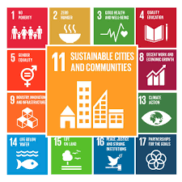
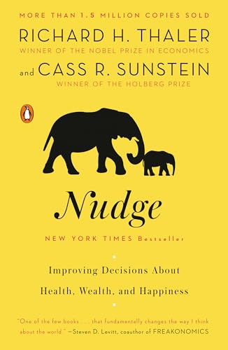
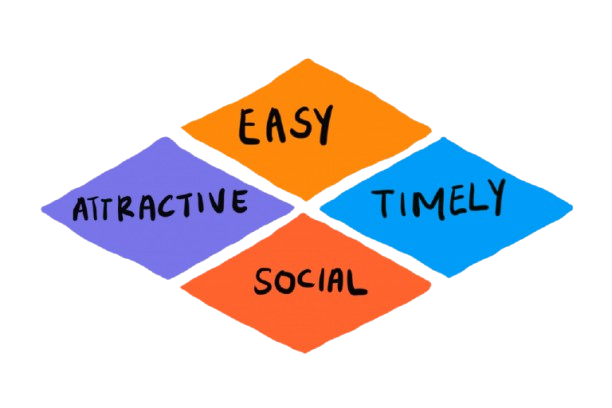

## Session Roadmap {background-image="img/sdg-wheel.jpg" background-opacity="0.5"}

:::{.nonincremental}
- **Part I: SDGs, Smart Cities & the Gap**
    - What the SDGs ask of cities
    - Revisiting smart cities — low-tech is smart too
    - The gap between technology and behavioural change
- **Part II: Design for People**
    - How to diagnose before you design
    - 8 behavioural concepts — each with a real-world example
- **Closing: Synthesis & SDG Reconnection**
:::

::: {.notes}
- This session is the deliberate counterpoint to Units 3–5: we've spent the semester learning powerful high-tech tools; now we ask whether they are always the most effective
- The central provocation: "smart" means effective, not digital
- Part I is brief — it sets the frame. Part II is the core of the session, concept by concept.
- Ask students to keep their project neighbourhood in mind throughout — they will recognise these patterns
- This is not anti-technology; it is pro-purposeful choice
:::

# Before we talk about cities...

::: {.r-fit-text}
Let's remember **why** we're building them.
:::

## {fullscreen=true}



## What are the SDGs? {background-image="img/sdg-wheel.jpg" background-opacity="0.5"}

- 17 Sustainable Development Goals. One 2030 deadline.
- Not a wishlist — a moral and political commitment made by 193 nations

::: {.callout .fragment}
SDGs are **wicked problems** — no single solution, no stopping rule
:::

::: {.fragment}
> Cities house 55% of the world's population, generate 80% of global GDP, and produce 70% of greenhouse gas emissions. Most SDGs will be won or lost here.
:::

::: {.notes}
- SDGs adopted in 2015 as part of the UN 2030 Agenda — this is the professional mandate for planners
- "Legally non-binding but morally binding" — useful framing for how planners should relate to this framework
- Unit 3: SDGs are the canonical wicked problem — when is SDG 11 "done"? It never is.
- technology is never the goal — the SDG outcome is
:::

## The Urban SDGs {.nonincremental background-color="#40E4FF"}

:::::: {.columns}
::: {.column width="60%"}

### SDG 11
_The Anchor_

**Sustainable Cities and Communities**

- Affordable and adequate housing
- Safe and sustainable transport
- Inclusive and accessible public spaces
- Reduced environmental impact
- Resilience to climate and disaster

:::
::: {.column width="40%"}

  

:::
::::::

::: {.notes}
- SDG 11 is explicitly about cities, but it cannot be achieved in isolation
- Ask: "Which SDG is most relevant to your project neighbourhood? Which others does it connect to?"

:::

## The Urban SDGs {.nonincremental background-color="#40E4FF"}

:::::: {.columns}
::: {.column width="60%"}

### Connected Urban Goals

- **SDG 3** — Good Health 
    <small>*(active mobility, clean air, green space)*</small>
- **SDG 10** — Reduced Inequalities
    <small>*(access, public space as equaliser)*</small>
- **SDG 13** — Climate Action 
    <small>*(modal shift, nature-based solutions)*</small>
- **SDG 15** — Life on Land 
    <small>*(urban biodiversity, green corridors)*</small>

:::
::: {.column width="40%"}

  

:::
::::::

::: {.notes}
- Demonstrate the connections: a cycling lane simultaneously achieves SDG 3 (health), SDG 10 (access), SDG 11 (sustainable transport), SDG 13 (emissions), SDG 15 (if tree-lined)
- This is why urban design has outsized SDG leverage — one intervention, multiple outcomes:::

## Smart Cities: A Recap {background-gradient="linear-gradient(to bottom, #2b2b2b, #4c462dff)"}

:::::: {.columns}
::: {.column width="55%"}

Sold as a high-tech promise:

- Real-time sensor networks monitoring everything
- AI-powered prediction and optimisation
- Digital twins simulating urban futures
- Seamless Mobility-as-a-Service platforms

:::
::: {.column width="45%" .fragment}

**The canonical examples:**

>Built. Expensive.
>
>Often: half-empty.

 

<small>
<ul>
    <li>Songdo *(South Korea)*</li>
    <li>Sidewalk Toronto *(cancelled, 2020)*</li>
    <li>NEOM *(under construction)*</li>
    <li>Masdar City *(stalled)*</li>
</ul>
</small>

:::
::::::

::: {.notes}
- the point is not to criticise the tools, but to contextualise them

These are not technology failures — they are failures of starting with technology before understanding people

- Songdo: streets optimised for efficiency, but low occupancy for years — the optimisation that forgot human desire
- Sidewalk Toronto: Google Sidewalk Labs' smart city project, cancelled due to privacy concerns and escalating costs
- NEOM: $500bn Saudi megaproject, highly contested on human rights and feasibility grounds

:::

## Smart ≠ High-Tech {background-color="#40E4FF"}

::: {.r-fit-text .fragment}
"Smart" means **effective**.
:::

- A well-placed bench that invites people to sit → smart intervention
- A narrowed road that slows cars without a sign → smart intervention
- A cycle lane that makes car trips optional → smart intervention

::: {.fragment}
**Low-tech IS smart city design — when it achieves the SDG outcome.**
:::

::: {.notes}
- Ask: "What does 'smart' mean to you?" then challenge the assumption
- This is explicitly not anti-technology — it is **pro-effectiveness**
- The test: does it achieve the SDG outcome? If yes, it is smart regardless of technical complexity
- Unit 5: "AI can find the pattern, but only the Planner can give it purpose" — same logic applies to all tools
:::

## The Gap {background-color="#FF8100"}

_High-tech smart city projects often underperform_

:::::: {.columns}
::: {.column .fragment}

**The technology works.**

- Sensors sense
- Algorithms optimise
- Dashboards display
_etc.._

:::
::: {.column .fragment}

**The city doesn't change.**

- People still drive
- Pollution still rises
- Inequality persists

:::
::::::

::: {.fragment}
> *The missing variable is not the system.*
>
>**It is the people in it.**
:::

::: {.notes}
- Key failure modes: digital divide (who can access smart city services?), high maintenance costs (who pays in Year 5?), top-down imposition (no community ownership), surveillance creep

- Sidewalk Toronto: partly collapsed due to data sovereignty — people didn't want to be monitored as a precondition for urban services
- Songdo: optimised for flow, but without human desire — result: well-connected ghost city for years

- Pause here: "Can you think of a smart city project that measurably changed how ordinary people live?"
- This is the bridge: we've diagnosed the problem — now Part II presents the alternative
:::

# Design for People

::: {.r-fit-text}
The most powerful urban tool has no processor.
:::

## What is "Low-Tech"? {background-image="img/bear-bin.jpeg" background-opacity="0.5"}

It is not primitive. It is **human-centred**.

:::::: {.columns}
::: {.column width="50%"}

**Low-tech design is:**

- Accessible <small>without a device or signal</small>
- Durable <small>works in 10, 20, 50 years</small>
- Legible <small>understood without a manual</small>
- Maintainable <small>at low cost</small>

::: {.fragment}

> **Fails gracefully** <small>when it fails at all</small>
:::

:::

::: {.column width="10%" }

:::

::: {.column width="40%" .fragment}

 

<small>

> Who needs a smartphone to use a bench?

> Who gets excluded when the Wi-Fi goes down?

>Who can maintain it after the consultant leaves?

</small>

:::
::::::

::: {.notes}
*If the answer is "everyone can use it" — you have a strong foundation.*

- "Fails gracefully" is critical: a broken smart sensor gives no data; a worn cobblestone still slows a car
- This is an equity argument: low-tech is more equitable because access is not gated by digital literacy or device ownership
- The maintenance gap: many smart city projects degrade after Year 5 when maintenance budgets are cut; low-tech ages more robustly
- Ask: "Think of a street that works well for everyone — what makes it work? Is any of it digital?"
:::

## Diagnose Before You Design {background-gradient="linear-gradient(to bottom, #2b2b2b, #4c462dff)"}

_Solutions can be low-tech. Diagnosis can be hybrid._

:::::: {.columns}
::: {.column width="50%" .fragment}

### Phase 1: Understand

**What is actually happening here?**

 
<small>
How do people move, gather, avoid?
What paths do they really take?
What spaces do they never use?
</small>

:::
::: {.column width="50%" .fragment}

### Phase 2: Design

**What is the minimum effective intervention?**

 
<small>
Work with observed behaviour — not assumed behaviour.
</small>

:::
::::::

::: {.notes}
"don't we need data before we can design well?"
- Yes — but data doesn't require expensive custom infrastructure

- Principle: appropriate technology at each phase. Diagnosis may use lightweight data tools; the intervention itself can still be human-centred.
- "The planner's role is gatekeeper" — gatekeeping starts with asking the right questions before choosing the tool
:::

## Diagnose Before You Design {background-gradient="linear-gradient(to bottom, #2b2b2b, #4c462dff)"}

_Solutions can be low-tech. Diagnosis can be hybrid._

### Low-Cost Diagnostic Tools 

- **Walking audits** 

    <small>— J. Gehl methodology: go out, count, observe, record </small>

- **Desire line mapping** 

    <small>— where are paths worn?</small>

- **Participatory community mapping** 

    <small>— residents as data collectors</small>

- **Open data**

    <small>Sentinel satellite (free ESA), OpenStreetMap, Strava Metro cycling flows</small>

- **Time-lapse cameras**

::: {.notes}
- Jan Gehl Architects: trained observers with clipboards, recording behaviour at different times of day. Simple, rigorous, replicable. Used in cities worldwide including Oslo.
- Sentinel satellite: ESA's freely available remote sensing data — accessible to any municipality with internet access
- Strava Metro: aggregated, anonymised cycling/running data — available to cities at low cost
:::

## Desire Lines {background-image="img/desire_lines.jpg" background-opacity="0.5"}

<small>
When planners build straight paths and people carve diagonal ones
</small>

:::::: {.columns}
::: {.column width="50%"}

**Who is wrong?**

> "Desire lines are the city's unwritten design critique."

The worn path across the grass is not vandalism. → It is **data**.

:::
::: {.column width="10%"}

:::

::: {.column width="40%" .fragment}

**What desire lines reveal**

- How people actually navigate
- Where friction exists in the planned environment
- The gap between designed intent and lived experience

:::
::::::

::: {.notes}

- Some universities (e.g. Ohio State) specifically delayed paving until behaviour could be observed first

- Connect to the diagnostic slide: desire lines are free behavioural data, visible to anyone paying attention
- Every desire line is a planning failure — and a design opportunity waiting to be claimed

- Ask: "Can you think of a desire line you walk regularly? What does it tell you about the original design?"
:::

## Woonerfs & Shared Space {background-image="img/woonerf_drachten.jpg" background-opacity="0.4"}

> "If you treat drivers like idiots, they act like idiots."
>
> <small>*Hans Monderman, Traffic Engineer (Netherlands)*</small>

- 2003: removed **ALL** traffic lights, signs, and kerbs from busy intersections
- Drivers were forced to negotiate <small>— make eye contact — pay attention</small>

:::: {.fragment}
**Speeds dropped. Accidents fell. Pedestrians felt safer.**

>**Uncertainty = attention = care.** 
:::

::: {.notes}
Design that reads desire rather than overriding it.

- Monderman was a traffic engineer — not a radical. His insight came from observing how drivers behave differently in unmarked rural lanes vs. heavily-signed urban roads
- The Laweiplein intersection in Drachten: car speeds dropped from 30km/h average to under 20km/h after removal of all signals; accidents reduced
- Woonerf (living street): Dutch concept giving pedestrians legal priority; speed controlled by design (narrowing, trees, varied paving), not signage

- Direct link to desire lines: Monderman observed how people actually navigate before redesigning

:::

## Nudge Theory

> <small> "A nudge is any aspect of the choice [...] that alters people's behaviour in a predictable way without forbidding any options or significantly changing their [...] incentives."</small>

::: {.columns}
::: {.column width=65% .fragment}

- People do not make rational choices in a vacuum
- They respond to **defaults, framing, salience, and friction**
- Change the environment → change the behaviour
- No mandate. No fine. No app.

:::
::: {.column width=35%}

{height=300}

:::
:::
<!-- end columns -->

::: {.notes}
- Richard Thaler received the Nobel Prize in Economics in 2017 for behavioural economics
- Classic non-urban examples: organ donation default switches (opt-out vs. opt-in); the fly painted in Schiphol airport urinals (reduced spillage 80%)

- Urban implication: you don't need to convince people to make better choices; make better choices the default or the easiest option
- A bike lane doesn't tell anyone not to drive — it makes cycling a visible, safe, obvious alternative
- Connection to planning ethics: nudge is non-coercive, but planners must still ask: who benefits from the default we are setting?
:::

## The Bench Test {background-image="img/white_ny.webp" background-opacity="0.5"}

<small>_William H. Whyte, The Social Life of Small Urban Spaces (1980)_</small>

Filmed New York City plazas systematically for years.

Revolutionary findings for their simplicity:

- **People sit where there is sun**
- **People sit where they can watch activity**
- **People sit where they can face each other**
- **Movable chairs > fixed benches** <small>agency matters</small>

>The best public spaces are designed from observation, not assumption.

::: {.notes}
- Whyte's method: time-lapse cameras, behavioural observers, systematic annotation — all available in 1980, zero digital technology required
- Conclusion: plazas that ignored sun angles, sightlines, and seat movability consistently failed; the fix was almost always cheap
- Direct application of nudge theory: the bench IS the choice architecture — where it points, what it faces, whether it can move all shape behaviour without any instructions
:::

---

<iframe width="1000" height="650" src="https://www.youtube-nocookie.com/embed/JPJkro5SBC0?si=wCuTMO30ErE3ncU0&amp;controls=0&amp;start=631" title="YouTube video player" frameborder="0" allow="accelerometer; autoplay; clipboard-write; encrypted-media; gyroscope; picture-in-picture; web-share" referrerpolicy="strict-origin-when-cross-origin" allowfullscreen></iframe>

## Levers of Behavioural Change {.nonincremental background-color="#40E4FF"}

<small>_EAST Framework — Behavioural Insights Team (UK)_</small>

**These are the levers planners pull — with or without technology.**

:::::: {.columns}
::: {.column width="60%"}

 

- **E — Easy**
<small>Remove friction from the desired behaviour.</small>

- **A — Attractive**
<small>Make the good option visible and appealing.</small>

- **S — Social**
<small>Leverage norms: what do others do here?</small>

- **T — Timely**
<small>Intervene at the right moment.</small>

:::
::: {.column width="40%"}

:::
::::::

::: {.notes}
- The Behavioural Insights Team (BIT) was set up by the UK Government in 2010 — the original "Nudge Unit"
- EAST emerged from applying behavioural economics to public policy across dozens of domains
- For urban design: EASY = protected cycling lane (not sharing with lorries). ATTRACTIVE = well-lit, tree-lined route. SOCIAL = seeing other cyclists/pedestrians making the same choice. TIMELY = infrastructure present when someone moves to a new neighbourhood before car habits form.
- Ask students to apply EAST to a local Oslo example — this grounds the framework quickly

:::

## Bogotá's Ciclovía {background-image="img/ciclovia.avif" background-opacity="0.4"}

:::::: {.columns}
::: {.column width="60%"}

Every Sunday, **75 km of streets** close to motor traffic.

**2 million people** walk, cycle, dance, and exercise.

:::{.fragment .highlight-green}
No app. No sensor. No algorithm.

Just: *a policy decision + a bollard.*
:::

:::
::: {.column width="40%" .fragment}

**EAST in action**

<small>
<ul>
    <li>**E**: Streets are safe — cars excluded</li>
    <li>**A**: Festive, colourful, communal</li>
    <li>**S**: Everyone is here — 2 million people</li>
    <li>**T**: Weekly ritual — it is just what Sundays mean</li>
</ul>
</small>

*Started in 1976. Still running. Zero technology required.*

:::
::::::

::: {.notes}
- Ciclovía predates the smartphone, the smart city concept, and the SDGs — and achieves multiple SDG outcomes every week
- Cost: coordination staff and bollards = tiny fraction of any smart mobility initiative
- Measurable impact: improved cardiovascular health, reduced Sunday emissions, public space equity (anyone can participate regardless of income or device)
- The political lesson: Ciclovía required a mayor willing to take road space from cars — not a tech problem, a political will problem
- Replicated in 100+ cities worldwide under the "Open Streets" model
- Ask: "Could an app achieve what Ciclovía achieves? Why or why not?"
:::

## Eyes on the Street {background-image="img/jacobs_bike.jpg" background-opacity="0.4"}
<small>

> "The bedrock attribute of a successful city district is that a person must feel personally safe and secure on the street among all these strangers."
>
> — _Jane Jacobs, The Death and Life of Great American Cities (1961)_
</small>

- Mixed use creates **continuous activity** at different hours — always someone watching
- Short blocks create **more intersections**, more movement, more eyes
- Active frontages: shops, cafés, entrances at street level

::: {.fragment .highlight-green}
**Safety without cameras** — natural surveillance as emergent design property
:::

::: {.notes}
- Writing in 1961 against Robert Moses and the urban renewal movement destroying mixed-use neighbourhoods for highways and towers
- The "sidewalk ballet": the informal, choreographed mix of people that makes streets safe emerges from mixed use — not from surveillance cameras
- Contrast: suburban cul-de-sacs designed for cars, empty of people for most hours — paradoxically less safe than a busy mixed-use street
- SDG 11 (sustainable cities) and SDG 10 (equality): the street as universal public space, but it only works if people are in it
- Ask: "Compare the feeling of walking on a busy mixed-use street at 9pm vs. a suburban cul-de-sac. What design choices created those feelings?"
:::

## Tactical Urbanism {background-image="img/tactical.webp" background-opacity="0.4" .nonincremental}

> _Cheap. Reversible. Testable._
>
> **Activate the street first. Then build.**

<small>

#### PARK(ing) Day
(San Francisco, 2005)
- 1 parking space → micro-park for one day
- Originally guerrilla activism; now a global annual event in 1,000+ cities

#### Paint-on bike lanes
(Bogotá, NYC Broadway, etc..)
- Test a cycle route with paint before committing to concrete
- Measure use. Adjust. Then build.

#### Times Square, NY
2009 — NYC DOT temporarily closed Broadway to cars. (J.SadiK Khan)
Result: foot traffic increased, air quality improved, businesses reported higher sales.
*2010: made permanent.*

</small>

::: {.notes}
- Tactical urbanism: low-cost, high-speed, temporary interventions that generate behavioural data and community buy-in before major investment
- Rebar studio (San Francisco) created PARK(ing) Day to demonstrate that street space could be reclaimed cheaply; it became a global movement
- Times Square: the transformation was tested before full investment — a politically risky decision made reversible by starting small
- Connection to desire lines and the diagnostic phase: tactical urbanism IS a combined diagnostic and design method — you learn what works by testing cheaply
- Ask: "What could you test in your project neighbourhood with a few cones, some chairs, and paint?"
:::

## The 15-Minute City {background-image="img/paris_15.avif" background-opacity="0.4"}

<small>_Carlos Moreno — Paris_</small>

**The idea:** every essential service within 15 minutes on foot or bicycle.

Not a technology. Not an app.

::: {.fragment .highlight-green}
A **zoning and density policy**.
:::

 

When the destination is reachable,
the car becomes optional.

::: {.fragment .highlight-green}
**Behaviour changes without mandating it.**
:::

::: {.notes}
- Carlos Moreno, professor at the Sorbonne, formalised the concept; Paris Mayor Hidalgo adopted it as city policy after COVID-19
- Key insight: the car was not always necessary — it was made necessary by planning decisions (zoning separation, suburban sprawl). Reverse the decisions, reduce the car.
- This is restoration, not innovation: it describes the structure of pre-automobile European cities including Oslo's older neighbourhoods
- Some controversy: right-wing commentators labelled it a "15-minute prison" — worth acknowledging and discussing
- The tool is the land use plan and zoning code — no smart city platform needed
- Connect to SDG 3 (health through active transport), SDG 13 (reduced emissions), SDG 11 (sustainable mobility)
:::

## CPH Cycling Revolution {background-image="img/copenhagen_cycling.gif" background-opacity="0.4"}

**62% of Copenhagen residents cycle daily.**

:::::: {.columns}
::: {.column width="50%"}

<small>
This did not happen because of a routing app.

It happened because of **40 years of sustained investment** in cycling infrastructure
beginning with the 1970s oil crisis.
<ul>
    <li>Protected lanes on every major street</li>
    <li>Cyclist-priority traffic signals</li>
    <li>Integration with public transport</li>
    <li>Annual "Cycling Account" measuring returns</li>
</ul>
</small>

:::
::: {.column width="50%" .fragment}

**The sequence that matters:**

1. *Build the infrastructure*
2. Behaviour shifts
3. Culture normalises
4. *Then* monitor and optimise

>**Technology followed the behaviour.**
>
>**Behaviour followed the design.**

:::
::::::

::: {.notes}
- In 1970, most Copenhageners drove. The 1973 oil crisis was the political catalyst for a decision to invest in cycling.
- Each year: more infrastructure, higher cycling share. By the 1990s cycling was culturally normal. By 2010, majority choice.
- The lesson: don't start with the monitoring platform; start with the infrastructure
- Copenhagen "Cycling Account": annual report measuring health, economic, and environmental returns — a model for evidence-based planning
- SDG 3 (health), SDG 11 (sustainable transport), SDG 13 (reduced emissions): achieved through asphalt, paint, and political will over 40 years
- Ask: "What would Norwegian cities need to do in the next decade to achieve what Copenhagen achieved in 40 years?"
:::

## Nature-Based Solutions {background-image="img/nbs_oslo.jpg" background-opacity="0.4"}

_Working with natural processes — not engineering around them_

:::::: {.columns}
::: {.column width="50%" .nonincremental}

**Hard infrastructure:**

- Concrete drainage channels
- Underground stormwater tunnels
- Sensor networks managing flow
- High maintenance cost
- Single function

:::
::: {.column width="50%" .nonincremental}

**Nature-Based Solutions:**

- Bioswales and retention ponds
- Green roofs and permeable surfaces
- Urban forests as flood buffers
- Lower long-term maintenance cost
- **Multi-functional**: flood control + cooling + biodiversity + wellbeing

:::
::::::

::: {.notes}
- NbS (Nature-Based Solutions) is now EU policy — the EU Biodiversity Strategy mandates urban greening targets
- Key argument: hard infrastructure does one thing and requires continuous maintenance; NbS provides multiple co-benefits and tends to improve over time
- The "sponge city" concept: piloted in Wuhan (China), mandated by the Chinese government as a response to flooding — permeable surfaces, wetlands, parks as flood infrastructure
- SDG 11 (urban resilience), SDG 13 (climate adaptation), SDG 15 (biodiversity): NbS achieves all three simultaneously — the kind of multi-goal leverage that sensor systems rarely match
:::

## CPH Cloudburst Management {background-image="img/couldburst.jpg" background-opacity="0.4"}

>*The world's most celebrated cloudburst management plan.*

:::::: {.columns}
::: {.column width="40%" .fragment .nonincremental}
<small>

### Option A: _Smart Drainage_

- Sensors throughout the network
- AI-predicted stormwater routing
- Real-time flow management
- High capital and maintenance cost
- One function: handle water

</small>

:::

::: {.column width="5%"}
:::

::: {.column width="55%" .fragment .nonincremental}

### Option B: Green Infrastructure ✓

- Sunken courtyards that flood deliberately
- Permeable streets and green roofs
- Water retained where it falls
- Lower long-term cost
- Also: parks, cooling, social space, biodiversity

:::
::::::

::: {.notes}
After devastating floods in 2011, Copenhagen made a choice:

- The 2011 Copenhagen floods caused €800m in damage — a once-in-a-century event projected to become more frequent
- The Copenhagen Cloudburst Management Plan (2012) is now a global reference for climate adaptation, studied in planning schools worldwide
- 300+ individual cloudburst projects across the city — each one simultaneously a park, sports ground, or community space
- Tåsinge Plads: a former car park transformed into a cloudburst plaza that handles 150mm/hour of rain — also one of the city's most loved small parks
- Political lesson: the city chose the more legible, community-friendly option; residents can see and use the investment; a sensor network is invisible until it fails
- Ask: "How do you measure the value of a park that also stops your basement from flooding?"
:::

## Synthesis {background-color="#40E4FF" .nonincremental}

:::::: {.columns}
::: {.column width="33%"}

### Understand

*Diagnose without a six-figure platform*

<small>
<ul>
    <li>Walking audits</li>
    <li>Desire line reading</li>
    <li>Community observation</li>
    <li>Open data</li>
</ul>
</small>

:::
::: {.column width="33%"}

### Design

*Work with human behaviour*

<small>
<ul>
    <li>Nudge, don't mandate</li>
    <li>Make the good option easy</li>
    <li>Add nature as infrastructure</li>
    <li>Test cheaply before building</li>
</ul>
</small>

:::
::: {.column width="33%"}

### Achieve

*The SDG outcome*

<small>
<ul>
    <li>Healthier people (SDG 3)</li>
    <li>Accessible space (SDG 10)</li>
    <li>Sustainable mobility (SDG 11)</li>
    <li>Climate resilience (SDG 13)</li>
</ul>
</small>

:::
::::::

::: {.fragment .r-fit-text .highlight-red}
**Each of these interventions achieved an SDG outcome.**

**None of them required a server.**
:::

::: {.notes}
- This is the synthesis slide — bring together everything from the session
- The three columns mirror the course's own logic: understand → design → achieve outcomes
- The fragmented quote is the final beat — let it land before the last two slides
- Ask: "Is there an example we discussed that couldn't have been designed without technology?" — honest answer: no, but technology could help monitor and evaluate faster
- Emphasise: this is not anti-tech; it is pro-purposeful choice; the planner needs both registers
:::

## Low-Tech Outperforming High-Tech {background-color="#2b2b2b"}

:::{.r-fit-text}

| | Low-Tech | High-Tech |
|---|---|---|
| **Durability** | Decades | 5–10 year cycles |
| **Accessibility** | Universal | Requires device / data literacy |
| **Maintenance** | Low | High (and often cut) |
| **Failure mode** | Graceful | Catastrophic |
| **Legibility** | Intuitive | Requires training |
| **SDG equity** | Reaches all residents | May exclude the vulnerable |

:::

::: {.notes}
- This table is meant to inform professional decision-making — not to prescribe, but to structure the choice
- "Graceful failure": a worn cobblestone still slows a car; a broken enforcement camera enforces nothing
- "Maintenance often cut": smart city infrastructure frequently degrades after Year 5 when maintenance budgets are reduced — well-documented in early smart city deployments
- The equity row is crucial: the populations most affected by urban challenges are often those most excluded from high-tech service delivery
- Both low-tech and high-tech have a legitimate place in the planner's toolkit; the professional skill is knowing when to use which
:::

## Design for the 2030 Agenda {background-image="img/sdg-wheel.jpg" background-opacity="0.5"}

<small>
The principles of low-tech design are not nostalgic. 
They are **the most durable path** to the commitments we made.
</small>

::: {.fragment }
1. **SDGs frame the *why*.** 
<small>
Design determines the *how*. Evaluate every intervention against its SDG contribution — not its technical sophistication.
</small>

:::

::: {.fragment }
2. **Human psychology is the core competency.**
<small>
Desire, nudge, legibility, nature — these determine whether an intervention changes behaviour.
</small>

:::

::: {.fragment}
3. **Low-tech interventions are often the most durable, equitable, and impactful.**
<small>
The bench. The bike lane. The stream. They outlast the platform.
</small>

:::

::: {.fragment}
4. **"Smart" means effective — not digital.**
<small>
A city that works for all its inhabitants — with or without a signal — is a smart city.
</small>

:::

::: {.notes}
- The four takeaways map directly to the four themes of the session
- Encourage students to apply this to their projects: "What is the low-tech argument for your intervention? What happens if the technology layer fails?"
- The course arc closes: spectrum from AI and digital twins (Unit 5) through human-centred low-tech design (Unit 7); professional planners navigate both registers
- Strong closing question: "What is the single low-tech intervention you would make in your project neighbourhood — and which SDG does it serve?"
:::
